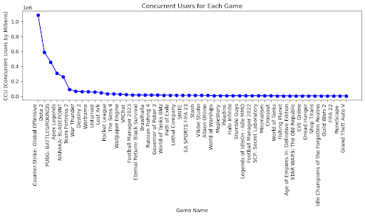

# SteamDataVisualization
## Project Introduction:
The project aims to analyse gaming trends and statistics using data from Steam’s API. The project will involve collecting and processing information about games, user reviews, playtime, genres and more. The data will be visualized in an interactive dashboard.

## Project Scope: 
Unveiling Global Gaming Trends through Python Flask-powered APIs, JavaScript-based Visualizations, and Genre-specific Insights.

## Data Collection and Web Scraping
### Web Scraping techniques:
- BeautifulSoup: Used for parsing HTML content and extracting information from Steam Charts’ website
- Splinter: Enabled automated browser interactions to navigate and fetch data from dynamic web pages
- Selenium: Employed for handling dropdowns and simulation user interactions

### Data Wrangling		
### Data Cleaning Steps:
- Conversion of Cents to Dollars: We meticulously transformed pricing data from cents to dollars for enhanced readability and analysis. 
- Handling NULL Values: Our data cleaning process included comprehensive strategies such as dropping rows or filling NULLs with suitable placeholders where applicable
- Reformatting Ownership and Price Columns:We reformatted the Ownership and Price columns to ensure uniformity and consistency. This involved removing unwanted characters, reformatting ranges, and converting these columns into appropriate data types for analysis

### Web Application using Flask

## Price Affecting concurrent users Analysis
- Example of analysis using the web application

### Quick visualization for Concurrent users for each game
 
 - There are huge gaps between the top 3 video games and the rest of the video games.

### Quick visual display for the most active games based on price.
 
 - The top 10 most active and popular games have no price tags on them.
 - Taking a look at the top 50, there are only 4 games with a price tag associated with them and 3 of those games are priced under $10.
 
 Analysis conclusion: From the data gathered we can conclude that there is a direct correlation for the popularity of video games based of price. So if we want to make  proposal for creating a new video game as an example. We can mention taking a look at a free to play model if we want to consistently have a big database of active players.
